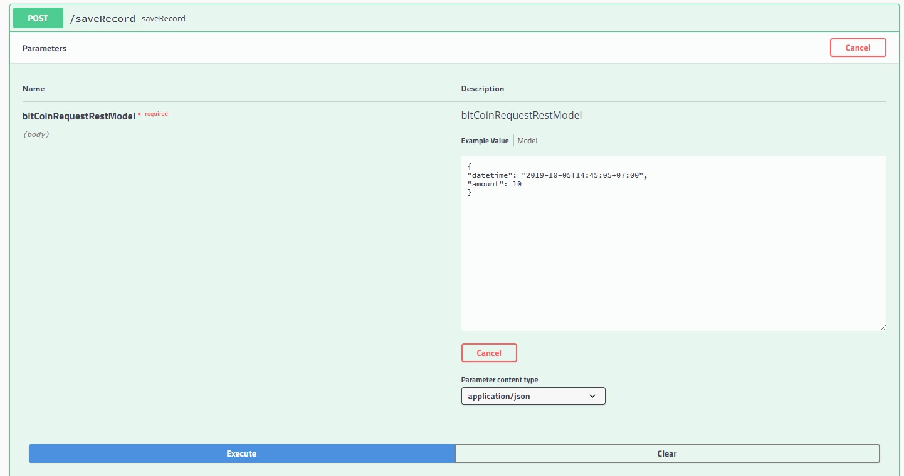
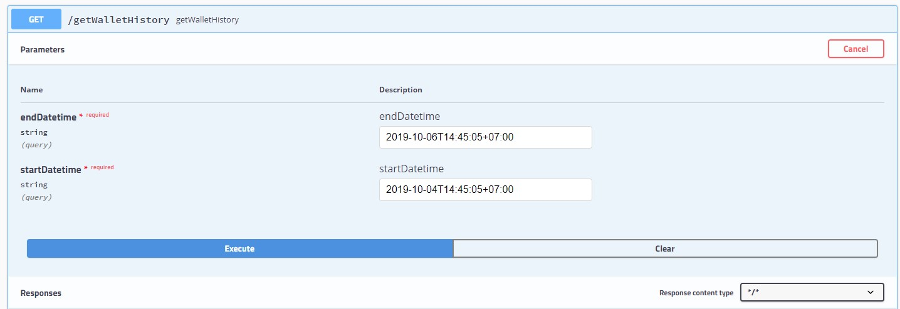
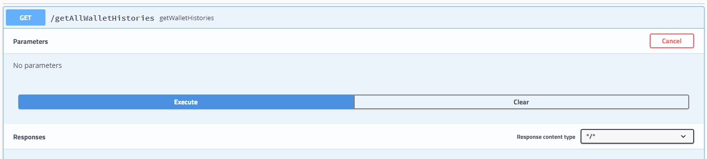

# Read Me

The project is written in java + spring boot. I have not used Kotlin, hence I used Java for this project. Learning a new language should not be difficult. I have also not written unit test cases as I did not have enough time to spend on the project. Unit-tests involve writing mocks services and then test your services. For detailed design and for extension of the design, A separate design doc is attached. 

### Compilation
To compile the project run the command `mvn clean compile -DskipTests`.
To package the application run the command `mvn clean compile -DskipTests package`
To execute the project run the command ` java -jar target/anymind-project-0.0.1-SNAPSHOT.jar --spring.config.location=src/main/resources/application.properties`.

The application properties are part of the resource package. I have also enabled swagger UI, for ease of testing. The rest application will start on port 8080.

To access the swagger API, use the URL `http://localhost:8080/swagger-ui.html`. The screen captures for requesting the endpoint in the Swagger UI are given below.
### Swagger API
#### Save Record API

#### Get WalletHistory API

#### Get All WalletHistory API API

### Curl Command
To test the endpoint use the CURL command as shown below
#### Saving Record
`curl -X POST "http://localhost:8080/saveRecord" -H "accept: */*" -H "Content-Type: application/json" -d "{\"datetime\": \"2019-10-05T14:45:05+07:00\",\"amount\": 10}"`

#### Get Wallet Histories
`curl -X GET "http://localhost:8080/getWalletHistory?endDatetime=2019-10-05T14%3A45%3A05%2B07%3A00&startDatetime=2019-10-04T14%3A45%3A05%2B07%3A00" -H "accept: */*"`

#### Get All Wallet Histories
`curl -X POST "http://localhost:8080/getAllWalletHistories" -H "accept: */*"`

I have not used JSON Data for the GET Wallet Request as the "Request Body" can be sent only in HTTP POST request. After a great thought, I decided GET will be apt and modified accordingly. 